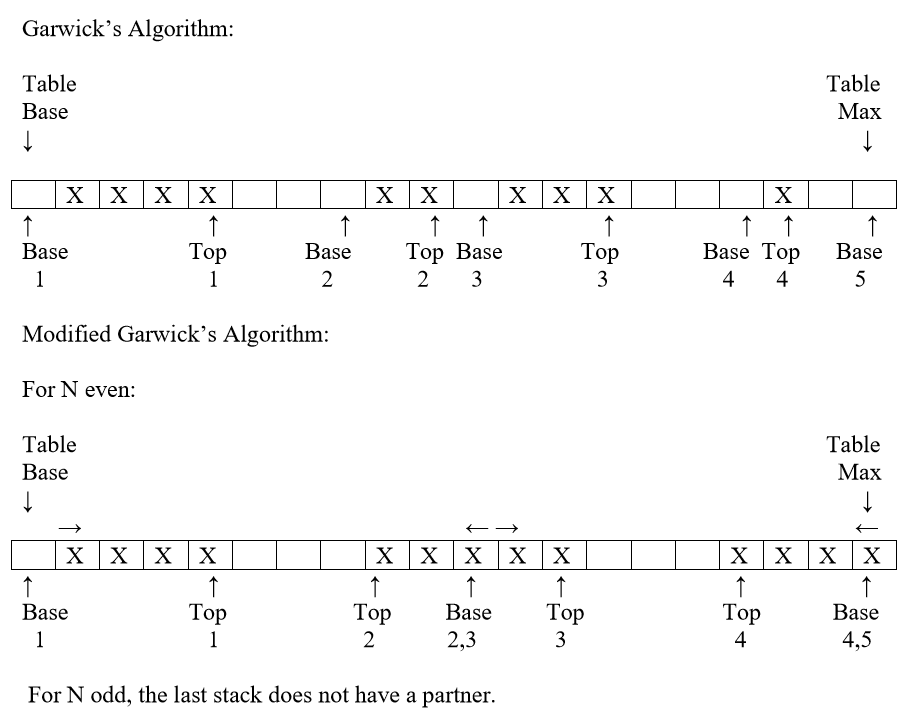
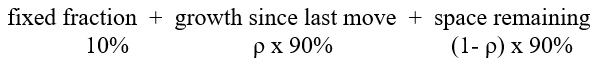
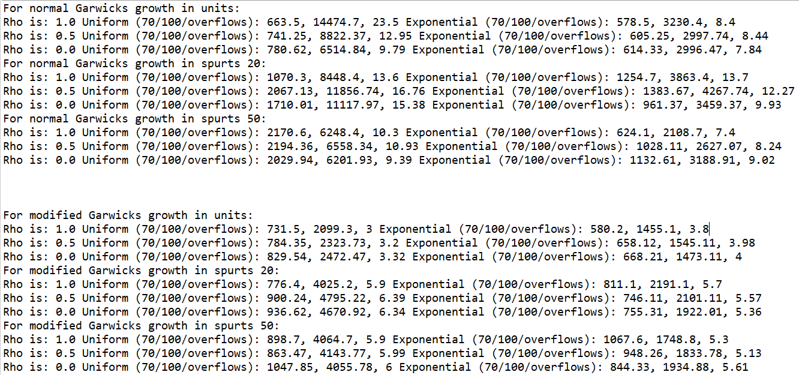

# Garwick's Algorithm and a Modified Garwick's

This is my code for Garwick's Algorithm and an improvement called modified Garwick's

# Description of Problem

Computers have not always had large amounts of memory to store information. When memory was in low supply, storing multiple data structures with empty space could lead to large amounts of waste.

Garwick's proposed solution is to allocate all of the stacks to the same table space and manage the tops and bottoms of the stacks dynamically until the whole space is full. In Garwick's algorithm, the stacks "face" left to right/low to high. In modified Garwick's the stacks are paired off and face each other, one left to right/low to high and the stack facing it right to left/high to low. Below are two examples showing small configurations of both versions.

# Description of Solution/Implementation

Garwick's algorithm and Modified Garwick's are relatively straightforward. As the top of one stack reaches the base of another stack the elements must be moved in order to prevent data from being overwritten by a new addition. Moving the tops and the bases one at a time, while technically a valid solution, leads to large amounts of overhead moving many elements many times.

Instead, my implementation involves allocating new space based on a formula:

In this formula, rho controls how we allocate the remaining slots of the table. A higher rho prioritizes allocating more space to the most recently growing stack, and a lower rho prioritizes off of the current size of the stacks.

The implementation has three main parts:
1. A function to add items to my table, and if there is a collision between two stacks it calls Garwick's algorithm
2. My Garwick's algorithm function which
  a. Calculates the spaces used and the stack size changes based off the formula and updates them accordingly
  b. Calls the moving algorithm to make sure everything is in its proper place
  c. Finalizes the addition of the element once there is proper space for it (or terminates if there is no space remaining)
3. My moving algorithm which loops through the stacks and moves elements without overwriting them

# Results

As part of my program, I made a testing function which runs both Garwick's and Modified Garwick's for 10 stacks with 1,000 spaces and prints out some resulting statistics. It runs for 3 different values of rho; 0.0, 0.5, and 1.0. This shows how allocating the remaining space will effect the total number of shuffles, and the number of individual moves. I also test over two different distributions of input; uniform and exponential (the probability of adding to a stack being 1 / (2 ^ (stack number)). My diagnostics print out shows the number of moves as the table was 70% full, then the number of moves when it was completely filled to 100% capacity, and the total number of times it overflowed and needed to move elements. Additionally I also show the difference between adding 1, 20, and 50 units at a time. Below is a picture of my results:

These results show a few things that we would expect: as rho decreases from 1.0 to 0.0 (we shift from only valuing growth, to only valuing space remaining) that the number of total overflows requiring movement to fill the space generally trends downwards. This might not be intuitive at first, but we can come up with some plausible hypotheses. If rho is 1.0 (we only value recent growth) and the number of spaces remaining is low, we will almost always allocate the few remaining spaces to where we just added. For the uniform distribution adding items 1 at a time, this results in a large amount of overflows because the probability we pick the stack again is low. We see that for the exponential distribution the number of overflows adding 1 at a time is much lower, because the probability we pick the stack again is better. But the previous analysis is only when we fill the table completely. If we knew we would only use about 70% of the space, higher rhos result in less moves overall.

Overall these results make sense, and fit well into the general paradigm that data structures and their various settings (and their resultant characteristics) offer different strengths for different use cases. Fine tuning a program for maximum performance will depend heavily on the statistics of the underlying data one is trying to store.

