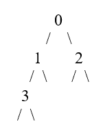
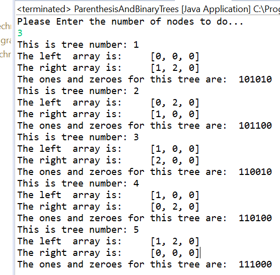
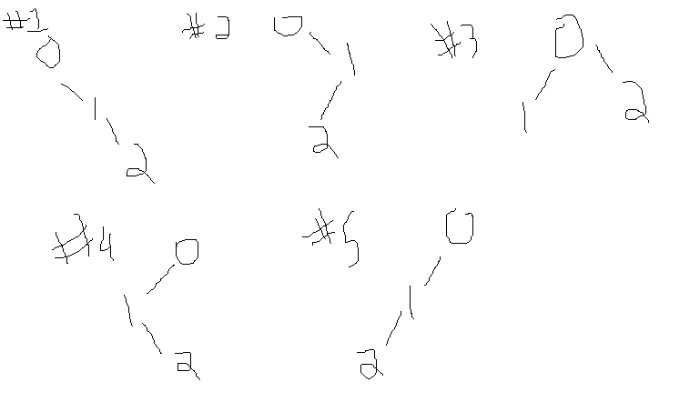

# Problem Name

This is a program to generate all the binary trees with n nodes so that their representations, using n 0’s and n 1’s (or n right and n left parentheses), would appear in lexicographic order. The tree is represented in memory only by the L and R arrays.

# Description of Problem

Binary trees are a useful data structures, and there are many ways to represent them inside a computer. For this problem, we think of a binary tree as an 2 arrays of left children and right children. This means that the tree:

could be represented as the 2 arrays:

Left: [1, 3, null, null]

Right: [2. null, null, null]

If we decide to do a pre-order traversal (see example of pre-order traversal: https://en.wikipedia.org/wiki/Tree_traversal#Pre-order_(NLR) ) of the tree, we would see the nodes in the order: 0, 1, 3, 2

Another way to do this traversal is to instead list a 1 when we are at a node, and a 0 when we encounter a null subtree. If we leave the last 0 off, the pre-order traversal would then become 1 1 1 0 0 0 1 0. 

This sequence represents 0, 1, 3, (3's null left subtree), (3's null right subtree), (1's null right subtree), 2, (2's null left subtree).

Knuth (https://en.wikipedia.org/wiki/Donald_Knuth) specified a "lexicographic" ordering of binaries trees using this 01/parentheses notation. Ultimately it means that we will start with the rightmost binary tree, and iterate through until we reach the leftmost binary tree.

# Description of Solution

The program takes a number of nodes as input, and then it initializes the necessary data structures and creates a tree that is an all right tree (it consists only of nodes with right subtrees). It then iterates through the possible trees by printing the information of the current tree, and then calling the nextTree() function on a current instance of the problem to update it to the next tree. It repeats this process until we reach a left only tree.

# Results

The program running on an input of 3 nodes is:

This is verifiable by hand, and I very quickly did it

