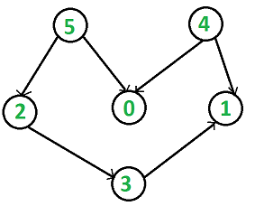
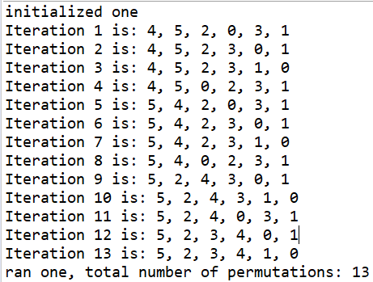

# Topological Sort

This is my code for a topological sort created in java. It uses a node and linked list to keep track of information about the problem and it prints up to the first 10 topological orderings it can find, and then it yields the total number of permutations as a check to prove the programs correctness for problems too large to check manually.

# Description of Problem

## Explanation/Example from https://www.geeksforgeeks.org/topological-sorting/

Topological sorting for Directed Acyclic Graph (DAG) is a linear ordering of vertices such that for every directed edge uv, vertex u comes before v in the ordering. Topological Sorting for a graph is not possible if the graph is not a DAG. 

For example, a topological sorting of the following graph is “5 4 2 3 1 0”. There can be more than one topological sorting for a graph. For example, another topological sorting of the following graph is “4 5 2 3 1 0”. The first vertex in topological sorting is always a vertex with in-degree as 0 (a vertex with no in-coming edges).

# Description of Solution

My solution to the topological sorting problem utilizes 2 separate linked lists to keep track of the current sorted order, and the nodes still yet to be added to the order. It also utilizes an array of linked lists (one for each node) to keep track of which nodes have successors that come after them, and an array of how many predecessors each node currently has.

My solution iterates from the lowest possible digit it could select by seeing which nodes are in the potential nodes list (have 0 predecessors), then it selects that node, removes it from the potential list and adds it to the sorted order list. When we add a node from the potential list to the sorted list, we access the linked list of successors of the node we just added and decreass the predecessor count for any nodes that came after it. If the predecessor count was reduced to 0 as a result, then the node is added into the list of potential nodes. 

This is continued recursively until there are no nodes remaining, and this sorted order is printed out. Once all the nodes are in the list, we need to backtrack and explore different permutations. This is done by taking the node we just added into the potential array, and moving it back, increasing the predecessor counts of any nodes that come after it, and potentially removing anything from the potential nodes list if their predecessor count increases to be greater than 0.

My algorithm reads in a specifically formatted string to initialize the problem, for the example image above, the string would be: "6\n 52\n 50\n 40\n 41\n 23\n 31". The first number represents the number of nodes the problem should contain (where the first node is node 0, node 1, node 2, ..., node n up to n = 10), every number after the first represents an edge from the first digit to the second digit. The number 50 represents that node 5 has an edge to node 0 (Nodes are 0 indexed).

# Results

The results for the example problem are:

